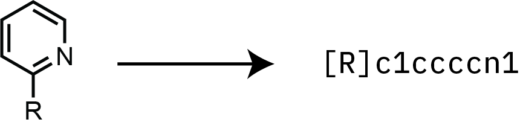
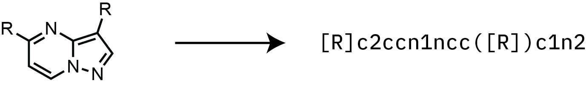

# The Heterocycle Isostere Explorer
## Introduction
This is a cheminformatics tool developed in the Brennan Group at the Centre for Medicines Discovery in the University 
of Oxford for the discovery of novel aromatic heterocyclic bioisosteres. **HCIE** identifies and ranks bioisosteric 
replacements using shape and electrostatic similarity (ESP) to a query molecule. It supports one-vector and 
two-vector (hash-based) alignments, and uses an RDKit-based backend and parallel processing for scalability.

---

## 🔍 Overview

Given a query molecule with one or two defined exit vectors, **HCIE** searches a database of aromatic heterocycles and 
returns the 
top-scoring matches by:

- Aligning probe molecules to the query via exit vector matching.
- Scoring the alignment based on shape and ESP similarity.
- Sorting and returning the top alignments.
- Exporting results to `.txt`, `.sdf`, and `.png` for further analysis.

This enables rapid identification of novel scaffold replacements that preserve key spatial features important for bioactivity

---

## Installation

### Dependencies
* [Python](https://www.python.org/) > v. 3.7
* [NumPy](https://numpy.org/)
* [RDKit](https://github.com/rdkit)
* [SciPy](https://scipy.org/)

The Python dependencies are listed in requirements.txt, and are best satisfied using a Conda installation ([miniconda](https://docs.anaconda.com/miniconda/miniconda-install/) 
or [anaconda](https://docs.anaconda.com/anaconda/install/))

### Installation Instructions
Clone this repo
```bash
git clone https://github.com/BrennanGroup/HCIE
```

Change directory to the cloned repo
```bash
cd HCIE
```
Note: If you are unsure about changing directories using the command line, follow instructions [here](https://www.wikihow.com/Change-Directories-in-Command-Prompt)).

It is highly advisable to create a new virtual environment for this package. If using conda, this can be achieved 
using
```bash
conda env create -f environment.yml
```

Once all the packages have installed, activate the 
environment with
```
conda activate hcie_env
```
When in the folder, run the following to install **HCIE** into the virtual environment.
```bash
pip install .
``` 

## Usage

Once the package has been installed into the virtual environment, it can be run from any directory as long as the 
virtual environment is activated.

Searches are based on a SMILES string representation of the query molecule, with one or two attachment points 
indicated by dummy atoms. [This tool](https://www.cheminfo.org/flavor/malaria/Utilities/SMILES_generator___checker/index.html) 
is very useful for generating SMILES expressions. Within a Python script (or session in the command line - 
```python```) run the following:

```aiignore
from hcie import VehicleSearch

search = VehicleSearch('<INSERT SMILES HERE>', name='<INSERT NAME HERE>')
search.search()
```

This will start a search, which will take anywhere from 4 to 15 minutes depending on the search type (one-vector 
searches tend to take longer, as a larger number of probe ligands are explored). The results 
will be deposited in a directory NAME_hcie_results, with the following structure:
```markdown
├── NAME_hcie_results
│   ├── NAME_aligned_results.sdf
│   ├── NAME_results.png
│   ├── NAME_results.txt
```
| File Name                  | Description                                                                                                                                                                                                                                           |
|----------------------------|-------------------------------------------------------------------------------------------------------------------------------------------------------------------------------------------------------------------------------------------------------|
| `NAME_aligned_results.sdf` | The 3D structures of the top 50 highest-scoring ligands, aligned to the query ligand in the alignment of highest similarity.                                                                                                                          |
| `NAME_results.png`         | Grid image of the structures of the top 50 returned molecules for easy inspection.                                                                                                                                                                    |
| `NAME_results.txt`         | Tab-delimited file containing scores (shape, ESP, total), conformer info, and SMILES <br/>for each ligand in the searched library, ordered by total score. The exit-vectors are illustrated in the SMILES strings for ease of downstream enumeration. |

### One-Vector Example


```aiignore
from hcie import VehicleSearch

search = VehicleSearch('[R]c1ccccn1', name='2-pyridine')
search.search()
```

### Two-Vector Example


```aiignore
from hcie import VehicleSearch

search = VehicleSearch('[R]c2ccn1ncc([R])c1n2', name='repotrectinib')
search.search()
```

---
## Contributing
We welcome contributions to HCIE!

If you'd like to contribute:

1. **Report Bugs / Request Features**  
   Open an [issue](https://github.com/BrennanGroup/HCIE/issues) on GitHub to report bugs, suggest improvements, or 
   request new features.

2. **Submit Code Improvements**  
   - Fork the repository.  
   - Create a new branch for your changes.  
   - Make your edits with clear commit messages.  
   - Submit a pull request with a brief explanation of your changes.

3. **Add New Molecules or Datasets**  
   If you’d like to expand the searchable space or add more chemical series, please reach out or submit an issue describing the source and scope of your additions.

4. **Documentation and Examples**  
   Contributions to improve the documentation or add example notebooks / use cases are also greatly appreciated.

If you have used HCIE in your research and would like to share your feedback or results, we’d love to hear from you!

---
## Acknowledgements
The scoring methodologies in HCIE are based largely on those described in [EspSim](https://github.com/hesther/espsim)
by Esther Heid and colleagues, and we gratefullly acknowledge their contribution to this project.

---
## Licence

This project is licensed under the MIT License.  
You are free to use, modify, and distribute this software with proper attribution.  
See the [LICENSE](LICENSE) file for full terms and conditions.
